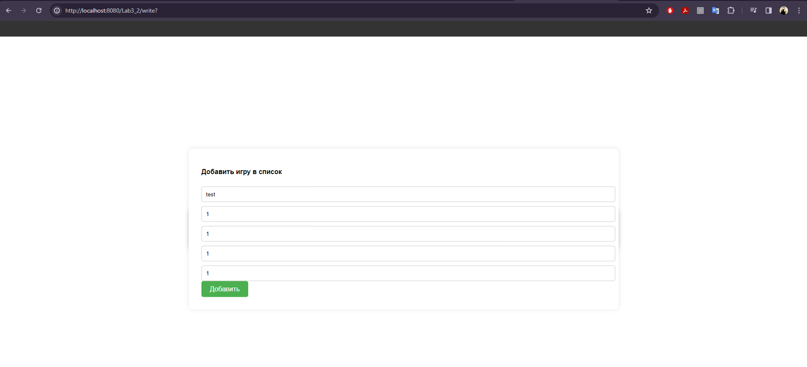
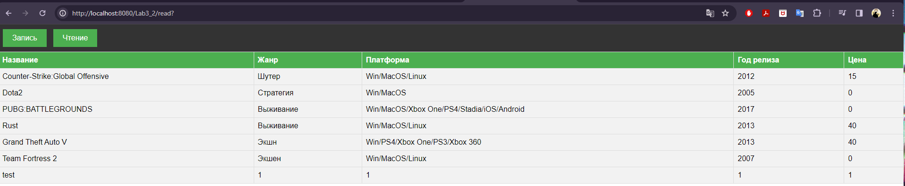

# Lab3_2
Разработать страницу, отображающую список объектов, с хранением их на сервере в файле. Передача данных осуществляется по JSON, клиент и сервер общаются по средствам передачи данных. Применить шаблон проектирования MVC. На странице предусмотреть форму добавления объектов в список.

Основные условия выполнения
Сформировать строку JSON
Передать строку JSON на сервер
Должно быть не менее 5 свойств у объекта (Например: Список студентов 1 - Имя, 2 - Фамилия, 3- группа, 4 - возраст, 5- изучаемый предмет)
Дессериализовать в объект (POJO) строку json
Записать полученную объект в файл на сервере
Вернуть строки JSON с сервера
Создать из строки JSON объект
Получить список всех объектов хранящихся на сервере в файле (можно в виде таблицы, в виде карточек, в виде контейнеров и т.д.)

